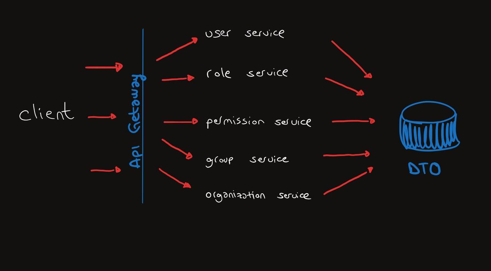
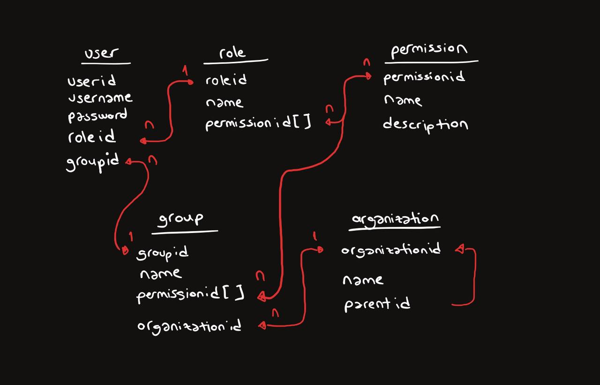

# 🚀 Approval System

Approval System, şirket içi onay ve yetki yönetimi için tasarlanmış bir mikroservis tabanlı Spring Boot projesidir. Proje, bağımsız mikroservisler aracılığıyla yetki ve onay süreçlerini yönetir. Gateway yapısı sayesinde tüm servislere tek bir port üzerinden erişim sağlanır.




## 📁 Proje Yapısı

  Proje, aşağıdaki mikroservislerden oluşmaktadır:
- User Service - "Kullanıcı yönetimi."
- Role Service - "Roller ve yetkileri."
- Permission Service - "Yetki tanımları ve kontrolü."
- Group Service - "Kullanıcı grupları ve ilişkileri."
- Organization Service - "Organizasyon hiyerarşisi yönetimi."
- Gateway Service - "Tek bir port üzerinden erişim sağlayan API Gateway."




## 🛠 Teknolojiler ve Araçlar

- Spring Boot - "Mikroservis geliştirme."
- Spring Cloud Gateway - "API Gateway."
- PostgreSQL - "Veritabanı yönetimi."
- Maven - "Proje ve bağımlılık yönetimi."
- REST API - "Servisler arası iletişim."

## ⚙️ Kurulum

1. Projeyi klonlayın:
```bash
git clone <repo-link>
```
2. Bağımlılıkları yükleyin:
```bash
mvn clean install
```
3. PostgreSQL veritabanınızı oluşturun:
```bash
CREATE DATABASE approvaldb;  //approvaldb veritanımızın adı ,dilersek değiştirebiliriz ama servislerin içerisindeki ../src/main/resources/application.properties dosyasında da birtakım değişiklikler yapılmalı unutmayın..
```
4. Mikroservisleri başlatın:
```bash
mvn spring-boot:run
```
Her mikroservis kendi portunda çalışır.
5. Gateway servisini başlatın:
```bash
cd gateway
mvn spring-boot:run
```
Gateway varsayılan olarak http://localhost:8080 üzerinden erişilebilir.


## 📝 Kullanım
1. Kullanıcı ve rollerin eklenmesi:
```
POST /user
POST /role
```
2. Yetkilendirme kontrolleri ve organizasyon hiyerarşisi düzenlemeleri yapılabilir.


## 📘 API Dökümantasyonu
Tüm servislerin API uç noktalarını test etmek için Postman kullanılabilir.


## 🤝 Katkıda Bulunma
Bu proje mikroservis mimarisini anlamak için geliştirilmiş basit ve yanlışları olabilecek bir sistem .Katkıda bulunmak isterseniz lütfen bir issue oluşturun veya pull request gönderin.


----------------------------------------------------

# 🚀 Approval System

Approval System is a microservice-based Spring Boot project designed for internal approval and authorization management. The project manages authorization and approval processes through independent microservices. Thanks to the gateway structure, all services can be accessed through a single port.


## 📁 Project Structure

The project consists of the following microservices:

- User Service - "User management."
- Role Service - "Roles and permissions."
- Permission Service - "Permission definitions and control."
- Group Service - "User groups and relationships."
- Organization Service - "Organization hierarchy management."
- Gateway Service - "API Gateway providing access through a single port."


## 🛠 Technologies and Tools

Technologies and Tools

- Spring Boot - "Microservice development."
- Spring Cloud Gateway - "API Gateway."
- PostgreSQL - "Database management."
- Maven - "Project and dependency management."
- REST API - "Communication between services."


## ⚙️ Setup

1. Clone the project:
```bash
git clone <repo-link>
```
2. Install dependencies:
```bash
mvn clean install
```
3. Create your PostgreSQL database:
```bash
CREATE DATABASE approvaldb;  //approvaldb is the name of our database, feel free to change it, but remember to make corresponding changes in the ../src/main/resources/application.properties file within the services.
```
4. Start the microservices:
```bash
mvn spring-boot:run
```
Each microservice runs on its own port. 
5. Start the Gateway service:
```bash
cd gateway
mvn spring-boot:run
```
The Gateway is accessible by default at http://localhost:8080.


##  📝 Usage
1. Adding users and roles:
```
POST /user
POST /role
```
2. Authorization checks and organization hierarchy adjustments can be made.


## 📘 API Documentation
Postman can be used to test the API endpoints of all services.

## 🤝 Contributing
This project is a simple system developed to understand microservice architecture, and it may contain errors. If you'd like to contribute, please create an issue or send a pull request.
